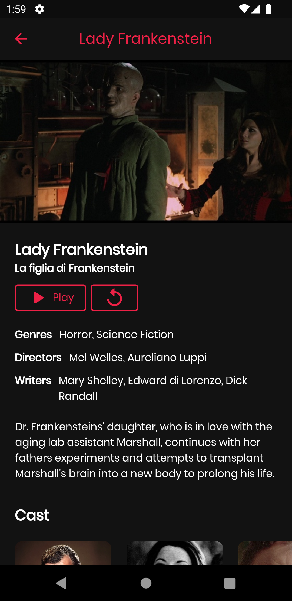
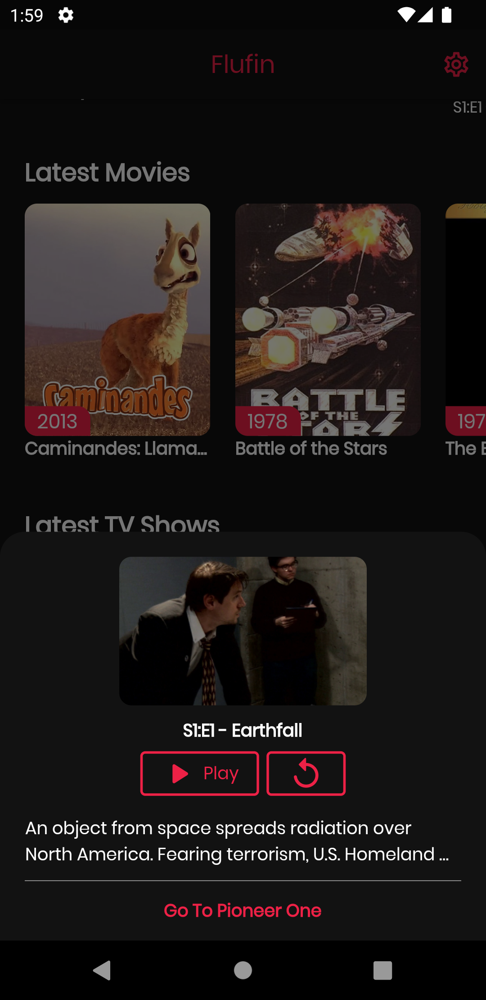
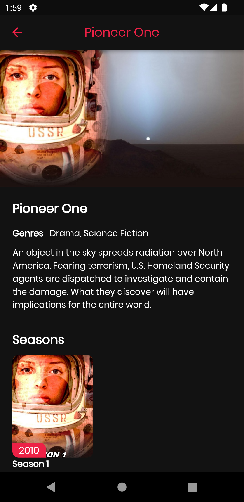

# Flufin

Flufin is a third-party Flutter application for Jellyfin

This project is in beta phase, and it is possible that there are many bugs, I work on it in my spare time.

## Announcement

The project will be down for a couple of weeks, during this time I will be creating an SDK for flutter/dart in a separate project, this to make support easier and keep the app as tidy as possible. On the other hand I will also work on moving the app to the Riverpod status manager, currently Provider is used. After these changes, there will be many improvements in the player and new functionalities. In the "Support Development" section you can contribute to support the development. 

## Screenshots
Home | Movie | Episode | Show
-----|-------|---------|-----
 |  |  | 

## Planned features

- Chromecast
- Syncplay
- iOS Release

## Support Development

If you find the project useful and want to support me, you will be grateful, and to be able to carry out the deployment on iOS.

## License
